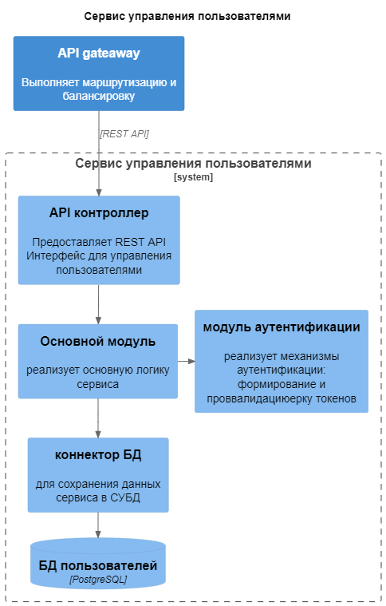
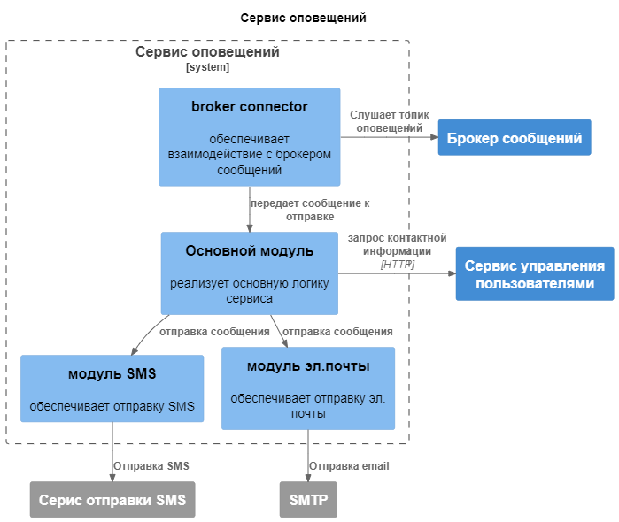
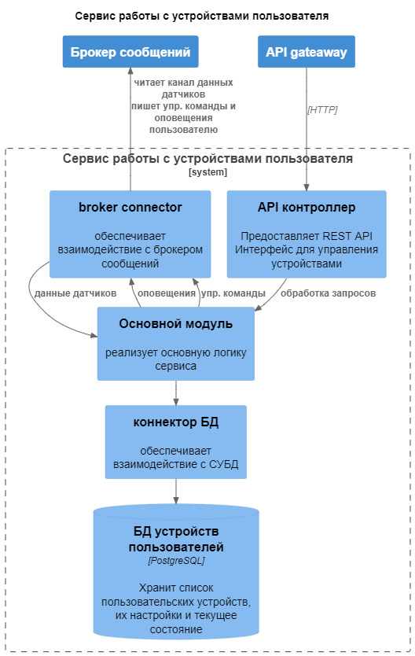
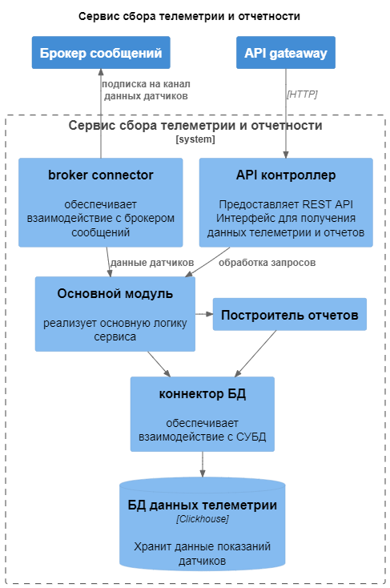
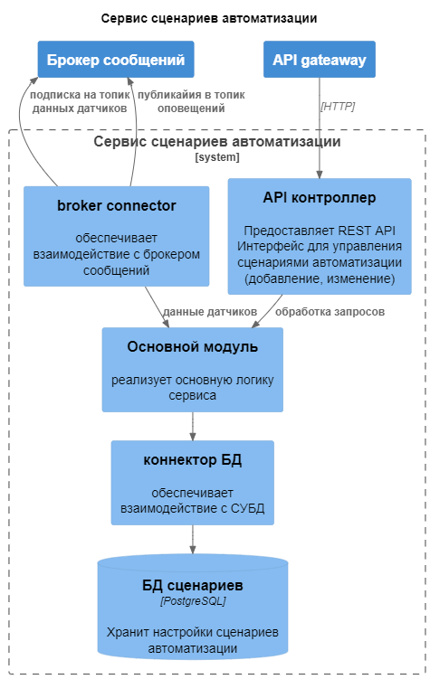
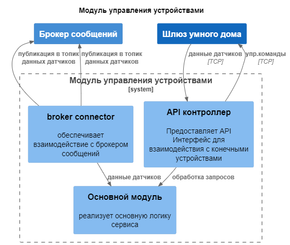
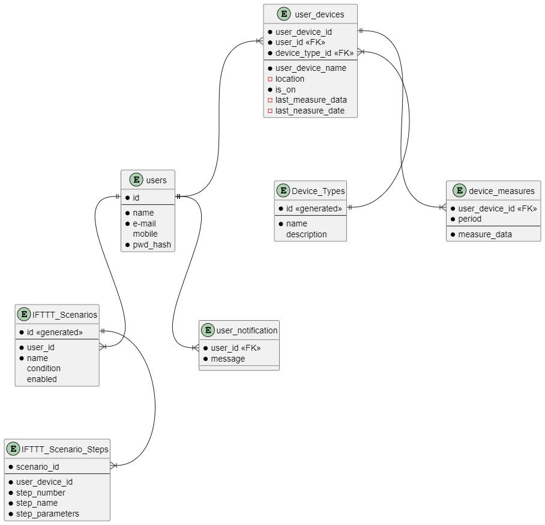

# Project_template

Это шаблон для решения проектной работы. Структура этого файла повторяет структуру заданий. Заполняйте его по мере работы над решением.

# Задание 1. Анализ и планирование

### 1. Описание функциональности монолитного приложения

**Управление отоплением:**

- Пользователи могут включать и выключать отопленние, а также устаналивать целевую температуру.
- история команд пользователя хранится только в логах системы и не доступна пользователю

**Мониторинг температуры:**

- Пользователи могут получить данные о текущей температуре своего дома
- Пользователи могут получить только текущую температуру, история изменения показаний датчиков не сохраняется

### 2. Анализ архитектуры монолитного приложения

- Язык программирования: Java
- База данных: PostgreSQL
- Архитектура: Монолитная, все компоненты системы (обработка запросов, бизнес-логика, работа с данными) находятся в рамках одного приложения.
- Взаимодействие: Синхронное, запросы обрабатываются последовательно.
- Масштабируемость: Ограничена, так как монолит сложно масштабировать по частям.
- Развёртывание: Требует остановки всего приложения.

### 3. Определение доменов и границы контекстов

**Домен:** Управление устройствами
- **Поддомен:** Пользовательская часть
  - управление списком подключенных устройств
  - просмотр состояния и управление устройствами
- **Поддомен:** Управление конечными устройствами
  - отправка команд управления на шлюз умного дома
  - прием показаний датчиков со шлюза умного дома
- **Поддомен:** Реализация сценариев автоматизации
  - настройка автоматических сценариев
  - реализация автоматических сценариев
- **Поддомен**: Сбор телеметрии и отчетность
  - регистрация показаний датчиков
  - построение отчетности

### **4. Проблемы монолитного решения**

- задержки и большое время отклика, т.к. устройство может отвечать медленно и его сетевая доступность низкая
- при увеличении числа пользователей такое решение сложно масштабировать
- усложняется деплой новых функций, т.к. требуется останавливать весь сервис
- единая база данных для всех функций может стать узким местом

Если вы считаете, что текущее решение не вызывает проблем, аргументируйте свою позицию.

### 5. Визуализация контекста системы — диаграмма С4

# Задание 2. Проектирование микросервисной архитектуры

**Диаграмма контейнеров (Containers)**

**Диаграмма компонентов (Components)**

**Диаграмма кода (Code)**

Скажу честно, рисовал ее не сам. Поскольку на ООП-языках профессионально не программирую, а что еще кроме диаграммы классов в данном случае можно описать, я не нашел.

# Задание 3. Разработка ER-диаграммы

# ❌ Задание 4. Создание и документирование API

### 1. Тип API

Укажите, какой тип API вы будете использовать для взаимодействия микросервисов. Объясните своё решение.

### 2. Документация API

Здесь приложите ссылки на документацию API для микросервисов, которые вы спроектировали в первой части проектной работы. Для документирования используйте Swagger/OpenAPI или AsyncAPI.